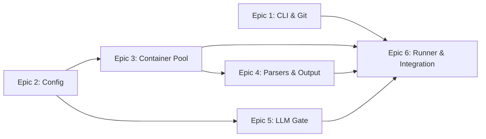

# Gatekeeper — Epic & Story Breakdown

| Field | Value |
|---|---|
| **Author** | Ichsan |
| **Date** | 2026-02-15 |
| **Version** | 1.2 |
| **PRD Reference** | [gatekeeper-prd.md](file:///home/irahardianto/.gemini/antigravity/brain/1fdd91da-3e63-47f2-990f-7ea9283a4070/gatekeeper-prd.md) |

---

## Epics Summary

| Epic | Name | Stories | Focus |
|---|---|---|---|
| 1 | CLI Foundation & Git Integration | 4 | Binary scaffold, commands, git hooks, stash, signal handling |
| 2 | Configuration System | 3 | gates.yaml parser, global config, stack detection |
| 3 | Container Pool & Execution Engine | 4 | Docker pool, warm runners, executor, cleanup |
| 4 | Parser Architecture & Output | 5 | Parser interface, SARIF, hints, formatters, progress |
| 5 | LLM Gate Engine | 3 | Gemini client, diff extraction, prompt/response |
| 6 | Parallel Runner & Integration | 4 | Engine orchestration, file filters, end-to-end |

**Total**: 6 Epics, 23 Stories

---

## Dependency Graph



**Recommended build order**: Epic 2 → Epic 1 → Epic 3 → Epic 4 → Epic 5 → Epic 6

---

## Epic 1: CLI Foundation & Git Integration

**Goal**: Establish the Go binary, CLI commands, and git hook lifecycle.

**FR Coverage**: FR1, FR2, FR3, FR4, FR23, FR24, FR26, FR27

---

### Story 1.1: Project Scaffold & CLI Framework

**As a** developer, **I want** a `gatekeeper` CLI binary with subcommands, **so that** I can interact with the tool.

**Acceptance Criteria**:
- Go module initialized with `cobra` (or `urfave/cli`) for CLI framework.
- Commands registered: `init`, `teardown`, `run`, `dry-run`, `cleanup`, `version`.
- Global flags registered: `--json`, `--skip`, `--skip-llm`, `--fail-fast`, `--verbose`, `--no-color`.
- `gatekeeper version` prints version, Go version, and build info.
- All commands print help text with usage examples.

**Technical Notes**:
- Use Go 1.23+.
- Use `cobra` for CLI framework (industry standard for Go CLIs).
- Structure: `cmd/gatekeeper/main.go` → `cmd/gatekeeper/commands/*.go`.

---

### Story 1.2: Git Hook Installation & Teardown

**As a** developer, **I want** `gatekeeper init` to install a pre-commit hook and `gatekeeper teardown` to remove it, **so that** validation runs automatically on commits.

**Acceptance Criteria**:
- `gatekeeper init`:
  - Validates `.git/` directory exists. If not, exit with error: `"Not a git repository."`.
  - Creates symlink `.git/hooks/pre-commit` → path to `gatekeeper` binary.
  - If hook file already exists: prompt user `"Pre-commit hook exists. Overwrite? [y/N]"`.
  - Creates `.gatekeeper/` directory if it doesn't exist.
  - Prints success: `"✅ Git pre-commit hook installed"`.
- `gatekeeper teardown`:
  - Removes `.git/hooks/pre-commit` symlink.
  - Does NOT remove `.gatekeeper/` directory.
  - Prints: `"🔓 Removed git pre-commit hook. Config preserved."`.
- The pre-commit hook, when triggered by git, executes `gatekeeper run` with the same arguments.

**Technical Notes**:
- FR2: use `os.Symlink()` for hook installation.
- FR3: use `os.Remove()` for teardown.
- Resolve binary path via `os.Executable()`.

---

### Story 1.3: Staged Files Isolation (Git Stash)

**As a** developer, **I want** Gatekeeper to validate only my staged files, **so that** unstaged changes don't affect validation results.

**Acceptance Criteria**:
- Before gate execution, run `git stash push --keep-index --include-untracked -m "gatekeeper-stash"`.
- Track whether a stash was actually created (handle case: no unstaged changes).
- After gate execution (pass or fail), run `git stash pop` if a stash was created.
- **If any gate used `writable: true`**: run `git checkout -- .` then `git clean -fd` before stash pop. This discards files written by tools inside writable containers, preventing merge conflicts. Since untracked files were stashed with `--include-untracked`, only tool-created files are cleaned.
- Use Go `defer` to guarantee stash restoration even on panic.
- **Register `os/signal.Notify` for `SIGINT` and `SIGTERM`**. When caught: (1) cancel the execution context, (2) wait for running gates to drain, (3) run `git stash pop`, (4) `os.Exit(1)`.
- If `git stash pop` fails (conflict), print warning: `"⚠️ Failed to restore stash. Run 'git stash pop' manually."`.
- If Docker daemon is unavailable, detect this **before** stashing to avoid leaving git in a stashed state.

**Technical Notes**:
- FR4: Critical correctness requirement.
- NFR7: `defer` for crash recovery **+ signal handler for Ctrl+C** (Go's `defer` does NOT run on `SIGINT`).
- NFR9: Pre-flight Docker check before stash.
- Abstracted behind `git.Service` interface for testability (NFR12).

---

### Story 1.4: Run & Dry-Run Commands

**As a** developer, **I want** `gatekeeper run` and `gatekeeper dry-run` to execute gates and report results, **so that** I can validate code manually or via the hook.

**Acceptance Criteria**:
- `gatekeeper run`:
  - Loads config (gates.yaml).
  - Executes stash → gates → unstash flow.
  - Exits 0 if all blocking gates pass.
  - Exits 1 if any blocking gate fails.
  - Non-blocking gate failures are reported but don't affect exit code.
- `gatekeeper dry-run`:
  - Identical execution to `run`.
  - Always exits 0 regardless of gate results.
  - Output prefix: `"🔍 Dry run — results are informational only"`.
- Both respect `--skip`, `--skip-llm`, `--fail-fast`, `--json`, `--verbose` flags.

**Technical Notes**:
- FR23, FR24, FR25, FR26, FR27.
- This story wires together the engine but depends on Epics 2-6 for full functionality. Use stubs initially.

---

## Epic 2: Configuration System

**Goal**: Parse project and user configuration into internal structs.

**FR Coverage**: FR5, FR6, FR7, FR8

---

### Story 2.1: Gates.yaml Parser

**As** the system, **I want** to parse `.gatekeeper/gates.yaml` into structured Go types, **so that** the engine knows what gates to run.

**Acceptance Criteria**:
- Define Go structs: `GatekeeperConfig`, `Defaults`, `Gate`.
- `Gate` struct supports all fields: `name`, `type` (exec|script|llm), `command`, `path`, `container`, `parser`, `timeout`, `blocking`, `on_error`, `only`, `except`, `writable` (bool, default `false`), `provider`, `mode`, `prompt`, `max_file_size`.
- Parse YAML using `gopkg.in/yaml.v3`.
- Validate required fields per gate type:
  - `exec`: `name`, `command` required.
  - `script`: `name`, `path` required.
  - `llm`: `name`, `provider`, `prompt` required.
- Apply defaults from `defaults` section to gates missing optional fields.
- Return clear validation errors: `"Gate 'lint': missing required field 'command' for type 'exec'"`.
- If `.gatekeeper/gates.yaml` is missing, return error: `"No .gatekeeper/gates.yaml found. Run 'gatekeeper init'."`.

**Technical Notes**:
- FR5, FR7, FR8.
- Unit test with valid, invalid, partial, and edge-case YAML fixtures.

---

### Story 2.2: Global Config & Environment Overrides

**As a** developer, **I want** my Gemini API key and preferences to persist globally, **so that** I don't repeat them per project.

**Acceptance Criteria**:
- Read `~/.config/gatekeeper/config.yaml` on startup.
- Fields: `gemini_api_key`, `container_ttl` (duration), `output.color` (bool), `output.verbose` (bool).
- Missing file is not an error (use defaults).
- Environment variables override config file values:
  - `GATEKEEPER_GEMINI_KEY` → `gemini_api_key`
  - `GATEKEEPER_TTL` → `container_ttl`
  - `GATEKEEPER_NO_COLOR=1` → `output.color: false`
- Config values are accessible via a `GlobalConfig` struct throughout the engine.

**Technical Notes**:
- FR6.
- Use `os.Getenv()` for env var fallback.
- NFR5: Validate that API key is never in project-level config.

---

### Story 2.3: Stack Auto-Detection (Init Defaults)

**As a** developer, **I want** `gatekeeper init` to detect my project's stack and generate a reasonable default `gates.yaml`, **so that** I don't start from scratch.

**Acceptance Criteria**:
- Scan project root for:
  - `go.mod` → Go stack (generate gates: `go test`, `golangci-lint`, `gosec`).
  - `package.json` → Node stack (generate gates: `eslint`, `vitest`/`jest`).
  - `requirements.txt` or `pyproject.toml` → Python stack (generate gates: `ruff`, `pytest`, `bandit`).
- If multiple detected (monorepo), include gates for all detected stacks.
- If none detected, generate a minimal config with one commented-out example gate.
- Write the generated config to `.gatekeeper/gates.yaml`.
- Print: `"✅ Detected Go project. Generated .gatekeeper/gates.yaml with 3 gates."`.
- If `.gatekeeper/gates.yaml` already exists, do NOT overwrite it. Print: `"⚡ Config already exists. Skipping generation."`.

**Technical Notes**:
- FR1.
- Generated YAML includes inline comments explaining each field.
- Generated formatter commands **must** use diff/check mode (e.g., `gofumpt -d`, `prettier --check`, `ruff format --check`). These are read-only, AI-agent-friendly (output is a compact unified diff), and work with the default `:ro` mount.

---

## Epic 3: Container Pool & Execution Engine

**Goal**: Manage Docker containers and execute commands inside them.

**FR Coverage**: FR11, FR12, FR13, FR14, NFR1, NFR2, NFR3, NFR8, NFR9, NFR10

---

### Story 3.1: Docker Pre-Flight Check

**As** the system, **I want** to verify Docker is available before doing anything, **so that** I fail fast with a clear message.

**Acceptance Criteria**:
- On startup, attempt `docker.Ping()` via Docker SDK.
- If Docker daemon is unavailable, exit immediately with a **context-specific error**:
  - `permission denied` → `"❌ Docker permission denied. Run: sudo usermod -aG docker $USER, then re-login."`
  - `connection refused` → `"❌ Docker is not running. Start it with: sudo systemctl start docker"`
  - Other / not installed → `"❌ Docker is required but not found. Install it from https://docker.com"`
- This check runs **before** git stash to avoid leaving git in a stashed state (NFR9).
- Implement behind a `ContainerRuntime` interface for mock injection in tests (NFR10).

**Technical Notes**:
- Use `github.com/docker/docker/client` Go SDK.
- Interface: `type ContainerRuntime interface { Ping(ctx) error; ... }`.

---

### Story 3.2: Warm Container Pool

**As** the system, **I want** to maintain a pool of warm Docker containers, **so that** gate execution is fast on repeated commits.

**Acceptance Criteria**:
- `Pool.GetOrCreate(image, projectPath string, writable bool)` returns an existing running container for the composite key, or creates a new one.
- **Composite pool key**: `hash(image + absolute_project_path + writable)`. This prevents cross-project container reuse and separates writable/non-writable pools.
- New containers:
  - Run `sleep infinity` as entrypoint.
  - Labeled: `gatekeeper.managed=true`, `gatekeeper.pool_key=<composite_hash>`, `gatekeeper.image=<image>`, `gatekeeper.project=<path>`, `gatekeeper.last_used=<RFC3339>`.
  - **Default (`:ro`)**: Bind mount project root to `/workspace` read-only. Prevents auto-formatter conflicts and root-owned cache files.
  - **`writable: true`**: Bind mount project root to `/workspace` read-write **with `--user $(id -u):$(id -g)`** to match host user's UID/GID (prevents root-owned files on Linux).
  - Both modes: Mount a container-local ephemeral `/tmp` for tools that need temp write access.
  - Working directory set to `/workspace`.
- Existing containers: matched by `gatekeeper.pool_key` label.
- `gatekeeper.last_used` label is updated after each exec.
- Multiple images are supported concurrently (e.g., `golang:1.23` + `node:20`).
- If image is not pulled locally, Docker SDK pulls it (lazy pull) with progress reporting to stderr.

**Technical Notes**:
- FR12, NFR2.
- Container creation: `ContainerCreate` + `ContainerStart`.
- Image pull: `ImagePull` with progress reporting to stderr.
- Use `sync.Mutex` for concurrent access to pool map.
- Use `crypto/sha256` for composite key hash.
- UID mapping: use `os/user.Current()` to get host UID/GID.

---

### Story 3.3: Container Executor (Docker Exec)

**As** the system, **I want** to run a command inside a warm container and capture output + exit code, **so that** I can validate code.

**Acceptance Criteria**:
- `Executor.Run(containerID, command string, timeout)` creates a Docker exec session.
- **Shell wrapping**: Command strings are wrapped as `sh -c '<command>'` (i.e., `[]string{"sh", "-c", command}`). This ensures proper parsing of quoted arguments, pipes (`|`), redirects (`>`), and environment variable expansion. Without this, `command: grep "hello world" .` would fail from naive space-splitting.
- **Stream demux**: Use `stdcopy.StdCopy` from `github.com/docker/docker/pkg/stdcopy` with `Tty=false` to correctly separate stdout and stderr into distinct buffers (NFR13). Without this, multiplexed output corrupts parser input.
- Returns `ExecResult{Stdout, Stderr, ExitCode, Duration}`.
- Respects gate timeout: cancels exec after timeout and returns system error.
- Handles container-not-running: returns system error with message.

**Technical Notes**:
- FR11, NFR1, NFR13.
- Docker SDK: `ContainerExecCreate(Cmd: ["sh", "-c", command], Tty: false)` → `ContainerExecAttach` → `stdcopy.StdCopy(stdout, stderr, resp.Reader)` → `ExecInspect` (for exit code).
- Use `context.WithTimeout` for timeout enforcement.

---

### Story 3.4: Lazy Cleanup & Manual Cleanup

**As a** developer, **I want** stale containers to be cleaned up automatically and on demand, **so that** my system resources aren't wasted.

**Acceptance Criteria**:
- **Lazy cleanup** (on every invocation):
  - List containers with label `gatekeeper.managed=true`.
  - Parse `gatekeeper.last_used` label.
  - Stop and remove containers where `time.Since(lastUsed) > TTL`.
  - Log: `"♻️ Cleaned up 2 stale containers"`.
- **Manual cleanup** (`gatekeeper cleanup`):
  - Stop and remove ALL containers with label `gatekeeper.managed=true`.
  - Log: `"♻️ Removed all Gatekeeper containers (3 stopped)"`.
- Both operations are idempotent (safe to run multiple times).

**Technical Notes**:
- FR13, FR14, NFR3, NFR8.
- Labels are the source of truth — no local state files.

---

## Epic 4: Parser Architecture & Output

**Goal**: Parse tool output into structured errors and format for humans/agents.

**FR Coverage**: FR16, FR17, FR18, FR25, FR27, FR28

---

### Story 4.1: Parser Interface & Registry

**As** the system, **I want** a pluggable parser architecture, **so that** I can support multiple tool output formats.

**Acceptance Criteria**:
- Define `Parser` interface:
  ```go
  type Parser interface {
      Parse(stdout, stderr []byte, exitCode int) (*ParseResult, error)
  }
  
  type ParseResult struct {
      Passed bool
      Errors []StructuredError
  }
  
  type StructuredError struct {
      File     string `json:"file"`
      Line     int    `json:"line"`
      Column   int    `json:"column,omitempty"`
      Severity string `json:"severity"`
      Rule     string `json:"rule,omitempty"`
      Message  string `json:"message"`
      Hint     string `json:"hint,omitempty"`
      Tool     string `json:"tool"`
  }
  ```
- Define `ParserRegistry` that maps parser names to implementations.
- Built-in parsers: `sarif`, `go-test-json`, `generic`.
- `generic` parser: `Passed = (exitCode == 0)`. On failure, single `StructuredError` with entire stderr as message.
- If parser name is not in registry, fall back to `generic` with a warning.

**Technical Notes**:
- FR16, FR17.

---

### Story 4.2: SARIF Parser

**As** the system, **I want** to parse SARIF-formatted output, **so that** I can support any linter that outputs SARIF.

**Acceptance Criteria**:
- Parse SARIF v2.1.0 JSON schema.
- Extract from each `result`: `ruleId`, `message.text`, `locations[0].physicalLocation` (file, line, column), `level` (error/warning/note).
- Map SARIF `level` to `StructuredError.Severity`: `error` → `error`, `warning` → `warning`, `note` → `info`.
- Map `ruleId` to `StructuredError.Rule` prefixed with tool name (e.g., `gosec:G101`).
- **Fail-closed**: If stdout is not valid JSON or doesn't match SARIF schema, return `ErrSystemError`.
- **Fail-closed**: If stdout is empty but exit code is non-zero, return `ErrSystemError`.
- Test with fixtures from: `golangci-lint --out-format sarif`, `gosec -fmt sarif`, `ruff --output-format sarif`.

**Technical Notes**:
- FR16, FR18.
- SARIF spec: runs[].results[] is the main array.
- NFR11: Include malformed/truncated fixtures in tests.

---

### Story 4.3: Static Hint Enrichment

**As an** AI agent, **I want** actionable fix hints for common errors, **so that** I can fix issues without web searching.

**Acceptance Criteria**:
- Define a static `hints.go` map: `map[string]string` keyed by rule ID (e.g., `gosec:G101`).
- Populate with ~30 common rules across Go, Node, Python tooling.
- After parsing, iterate over `StructuredError` results:
  - If `Hint` is already populated (parser/tool provided it), keep it.
  - If `Hint` is empty and `Rule` matches hint database, populate `Hint`.
  - If no match, leave `Hint` empty.
- Hints should be concise, actionable, single-sentence.

**Technical Notes**:
- FR17.
- Examples:
  - `gosec:G101` → `"Use environment variables or a secret manager instead of hardcoded credentials."`
  - `gosec:G201` → `"Use parameterized queries to prevent SQL injection."`
  - `golangci-lint:errcheck` → `"Always handle returned errors with 'if err != nil'."`

---

### Story 4.4: Output Formatters (CLI & JSON)

**As a** developer/agent, **I want** results formatted for my use case, **so that** I can read or parse them efficiently.

**Acceptance Criteria**:
- **CLI Formatter** (default):
  - Summary header: gate names, pass/fail icons, durations.
  - Failed gates: list errors with file, line, severity, rule, message, hint.
  - Hint lines prefixed with 💡.
  - System errors prefixed with 💥.
  - Uses ANSI colors (disable with `--no-color`).
  - `--verbose`: appends raw stdout/stderr after parsed errors.
- **JSON Formatter** (`--json`):
  - Single JSON object to stdout.
  - Schema: `{ passed: bool, duration_ms: int, gates: [{ name, type, passed, blocking, duration_ms, errors: [StructuredError], system_error?: string }] }`.
  - Human messages (progress, warnings) go to stderr.
- Both formatters implement a `Formatter` interface:
  ```go
  type Formatter interface {
      Format(results []GateResult) string
  }
  ```

**Technical Notes**:
- FR25, FR27.
- Use `encoding/json` with `json.MarshalIndent` for JSON.
- Use `fatih/color` or similar for ANSI colors.

---

### Story 4.5: Real-Time Progress Indicators

**As a** developer, **I want** to see real-time progress while gates are running, **so that** I know the tool hasn't frozen (especially during slow LLM gates).

**Acceptance Criteria**:
- While gates execute, display a live-updating view:
  ```
  🔒 Gatekeeper — running 4 gates...
  
    ⏳ unit_tests      running...
    ✅ lint             0.8s
    ⏳ security         running...
    ⏳ secret_review    running... (3.2s elapsed)
  ```
- Gates transition from `⏳ running...` → `✅`/`❌`/`💥` as they complete.
- For gates running > 2s, display elapsed time to reassure the user.
- Progress is written to stderr (not stdout) to avoid corrupting `--json` output.
- In `--json` mode, progress display is fully suppressed.
- Use terminal overwrite (`\r` + ANSI escape) for in-place updates; fall back to line-by-line if not a TTY.

**Technical Notes**:
- FR28.
- Use `isatty` check to determine if stdout is a terminal.
- `sync.Mutex` to synchronize progress updates from concurrent gate goroutines.

---

## Epic 5: LLM Gate Engine

**Goal**: Integrate Gemini 3 Pro for semantic code review on staged diffs.

**FR Coverage**: FR19, FR20, FR21, FR22

---

### Story 5.1: Gemini Client

**As** the system, **I want** a Gemini 3 Pro API client, **so that** I can send code for review and parse responses.

**Acceptance Criteria**:
- Use the official Go SDK `google.golang.org/genai`.
- Reads API key from `GlobalConfig.GeminiAPIKey`.
- If API key is missing and an LLM gate is defined, fail with: `"❌ Gemini API key required. Set GATEKEEPER_GEMINI_KEY or add to ~/.config/gatekeeper/config.yaml"`.
- **Must** use Gemini's native Structured Output mode:
  - Set `ResponseMIMEType: "application/json"` on the model config.
  - Pass `ResponseSchema` matching the `[]StructuredError` JSON Schema.
  - This forces the API to **only** return valid JSON, eliminating markdown wrapping and conversational filler (Landmine fix).
- Sets `temperature: 0` for determinism.
- Implements retry with exponential backoff: 3 attempts, 1s → 2s → 4s delays.
- Network failures return system error (respects gate `on_error`).
- Timeout: 30s per request.

**Technical Notes**:
- FR21, FR22.
- Use `google.golang.org/genai` (the maintained SDK; older `github.com/google/generative-ai-go` is deprecated).
- Gemini 3 Pro fully supports `response_schema` with `anyOf`, `$ref`, and property ordering.

---

### Story 5.2: Diff Extraction for LLM Gates

**As** the system, **I want** to extract staged diffs for LLM review, **so that** the LLM reviews what's actually being committed.

**Acceptance Criteria**:
- Run `git diff --cached` to get staged diffs.
- Split diffs per file.
- For each file, check size against gate's `max_file_size`:
  - If exceeds limit: skip file, add to `skipped_files` list.
  - If within limit: include in LLM review.
- If all files are skipped, gate passes with warning: `"All staged files exceed size limit — skipped LLM review"`.
- Return list of `{file_path, diff_content}` pairs.

**Technical Notes**:
- FR19, FR20.
- Use `git.Service` interface from Epic 1.

---

### Story 5.3: LLM Prompt Construction & Response Parsing

**As** the system, **I want** to construct effective prompts and parse LLM responses, **so that** LLM gates produce structured errors.

**Acceptance Criteria**:
- Construct prompt with template:
  ```
  You are a code reviewer for a pre-commit hook. Review the following diff and 
  identify issues. Respond ONLY with a JSON array matching this schema:
  [{"file": "string", "line": int, "severity": "error|warning|info", 
    "message": "string", "hint": "string"}]
  If no issues, return: []
  
  Review rules: {user_prompt}
  Language: {detected_language}
  
  {diff_content}
  ```
- Parse response as `[]StructuredError`. Set `Tool` field to provider name (e.g., `gemini-3-pro`).
- Because `response_schema` is set on the client (Story 5.1), the response is guaranteed to be valid JSON matching the schema. Use `json.Unmarshal` directly.
- **Validation**: Cross-reference reported line numbers against actual diff — discard entries with line numbers outside the diff range (hallucination mitigation).

**Technical Notes**:
- FR19, FR22.
- JSON parsing is simplified because Gemini's Structured Output mode eliminates markdown wrapping.
- Log raw LLM response at `--verbose` level for debugging.

---

## Epic 6: Parallel Runner & Integration

**Goal**: Wire everything together into the parallel execution engine.

**FR Coverage**: FR9, FR10, FR15, FR18, FR23, FR24

---

### Story 6.1: Gate Interface & Factory

**As** the system, **I want** a unified gate interface, **so that** all gate types (exec, script, llm) are executed uniformly.

**Acceptance Criteria**:
- Define `Gate` interface:
  ```go
  type Gate interface {
      Execute(ctx context.Context) (*GateResult, error)
  }
  
  type GateResult struct {
      Name        string           `json:"name"`
      Type        string           `json:"type"`
      Passed      bool             `json:"passed"`
      Blocking    bool             `json:"blocking"`
      DurationMs  int64            `json:"duration_ms"`
      Errors      []StructuredError `json:"errors,omitempty"`
      SystemError string           `json:"system_error,omitempty"`
      RawOutput   string           `json:"raw_output,omitempty"`
  }
  ```
- `GateFactory` creates concrete gate instances from config:
  - `exec` → `ExecGate` (uses Container Pool + Executor + Parser).
  - `script` → `ScriptGate` (copies script into container, executes).
  - `llm` → `LLMGate` (uses Gemini Client + Diff Extraction).
- Factory resolves parser from registry, container from pool.

**Technical Notes**:
- FR7.

---

### Story 6.2: Parallel Execution Engine

**As** the system, **I want** to run all gates concurrently, **so that** commit validation is fast.

**Acceptance Criteria**:
- `Engine.RunAll(ctx, gates []Gate)` launches all gates as goroutines.
- Collects results via channels.
- Applies `on_error` policy per gate to system errors.
- Applies `blocking` policy per gate to validation failures.
- If `--fail-fast`: uses `context.WithCancel`, cancels remaining gates on first blocking failure.
- Returns aggregated `[]GateResult`.
- Total duration tracked (wall-clock, not sum of individual gates).

**Technical Notes**:
- FR9, FR10.
- Use `sync.WaitGroup` + buffered channel for result collection.
- Use `context.Context` for cancellation propagation.

---

### Story 6.3: File Filter Engine

**As** the system, **I want** to skip gates that don't match staged files, **so that** irrelevant gates are not executed.

**Acceptance Criteria**:
- Before execution, get list of staged files via `git diff --cached --name-only`.
- For each gate with `only` patterns: match staged files against glob patterns. If no staged files match, skip gate.
- For each gate with `except` patterns: exclude matching files. If all files excluded, skip gate.
- Skipped gates are reported in output: `"⏭️ lint — skipped (no matching files)"`.
- If no filters defined, gate runs unconditionally.

**Technical Notes**:
- FR15.
- Use `path.Match()` or `doublestar` library for glob matching.

---

### Story 6.4: End-to-End Integration & Smoke Test

**As** a developer, **I want** the entire pipeline to work end-to-end, **so that** I can trust Gatekeeper with real commits.

**Acceptance Criteria**:
- Integration test: create a temp git repo, stage files with known issues, run `gatekeeper run`, verify:
  - Exit code is 1 (gate failed).
  - JSON output contains correct file/line/message.
  - Unstaged changes are preserved (stash restored).
- Integration test: stage clean files, run `gatekeeper run`, verify exit code 0.
- Integration test: `gatekeeper dry-run` with failing gates, verify exit code 0.
- Integration test: `--skip` flag skips named gate.
- Integration test: `writable: true` gate → verify files written during exec are discarded before stash pop, and host file ownership matches current user.
- Smoke test: `gatekeeper init` in Go project → `gatekeeper run` → meaningful output.

**Technical Notes**:
- Full pipeline: config → stash → pool → exec → parse → hint → format → unstash.
- Use `testcontainers-go` for Docker integration tests.
- NFR10, NFR11, NFR12.

---

## FR Coverage Matrix

| FR | Description | Story |
|---|---|---|
| FR1 | Stack auto-detection | 2.3 |
| FR2 | Git hook installation | 1.2 |
| FR3 | Hook teardown | 1.2 |
| FR4 | Staged files isolation | 1.3 |
| FR5 | gates.yaml loading | 2.1 |
| FR6 | Global config + env vars | 2.2 |
| FR7 | Gate types (exec/script/llm) | 2.1, 6.1 |
| FR8 | Gate optional fields | 2.1 |
| FR9 | Parallel execution | 6.2 |
| FR10 | Fail-fast | 6.2 |
| FR11 | Docker exec | 3.3 |
| FR12 | Warm container pool | 3.2 |
| FR13 | Lazy cleanup | 3.4 |
| FR14 | Manual cleanup | 3.4 |
| FR15 | File filters | 6.3 |
| FR16 | Parser registry | 4.1 |
| FR17 | StructuredError + hints | 4.1, 4.3 |
| FR18 | Fail-closed parsing | 4.1, 4.2 |
| FR19 | LLM diff review | 5.2, 5.3 |
| FR20 | File size skip | 5.2 |
| FR21 | LLM retry logic | 5.1 |
| FR22 | LLM structured output (native API) | 5.1, 5.3 |
| FR23 | Run exit codes | 1.4 |
| FR24 | Dry-run always exit 0 | 1.4 |
| FR25 | JSON output | 4.4 |
| FR26 | Skip flags | 1.4 |
| FR27 | Verbose flag | 4.4 |
| FR28 | Progress indicators | 4.5 |

---

## Recommended Implementation Order

### Phase 1: Foundation (Week 1)

| Order | Story | Rationale |
|---|---|---|
| 1 | 1.1 | CLI scaffold — everything hangs off this |
| 2 | 2.1 | Config parser — gates.yaml drives everything |
| 3 | 2.2 | Global config — needed for API keys |
| 4 | 3.1 | Docker pre-flight — fail fast if no Docker |

### Phase 2: Container Engine (Week 2)

| Order | Story | Rationale |
|---|---|---|
| 5 | 3.2 | Container pool — core infrastructure |
| 6 | 3.3 | Executor — run commands in containers |
| 7 | 3.4 | Cleanup — resource hygiene |
| 8 | 4.1 | Parser interface — define contracts |

### Phase 3: Parsers & Output (Week 3)

| Order | Story | Rationale |
|---|---|---|
| 9 | 4.2 | SARIF parser — universal coverage |
| 10 | 4.3 | Hint enrichment — DX polish |
| 11 | 4.4 | Output formatters — CLI + JSON |
| 12 | 5.1 | Gemini client — LLM foundation |
| 13 | 5.2 | Diff extraction — LLM input |
| 14 | 5.3 | Prompt/response — LLM output |

### Phase 4: Integration (Week 4-5)

| Order | Story | Rationale |
|---|---|---|
| 15 | 6.1 | Gate interface — unified abstraction |
| 16 | 6.2 | Parallel engine — core runner |
| 17 | 6.3 | File filters — monorepo support |
| 18 | 4.5 | Progress indicators — UX polish |
| 19 | 1.2 | Git hook install — wire up trigger |
| 20 | 1.3 | Git stash + signal handling — correctness |
| 21 | 1.4 | Run/dry-run — end-to-end commands |
| 22 | 2.3 | Stack detection — onboarding DX |
| 23 | 6.4 | Smoke test — final validation |

---

## Summary

| Metric | Value |
|---|---|
| **Total Epics** | 6 |
| **Total Stories** | 23 |
| **Estimated Timeline** | ~5 weeks |
| **Estimated LOC** | ~3,500-4,000 |
| **Target Phase** | MVP |

> [!NOTE]
> Timeline revised from 4 weeks to 5 weeks (closer to ~5-6 weeks with Docker SDK verbosity and SARIF edge cases). LOC estimate revised from 2,500 to ~4,000 based on Docker stream demux, signal handling, and progress indicator complexity.

The implementation order prioritizes **infrastructure before features**: Docker pool and parsers are built first, git hooks and the parallel runner are wired up last. This allows each layer to be tested independently before integration.
