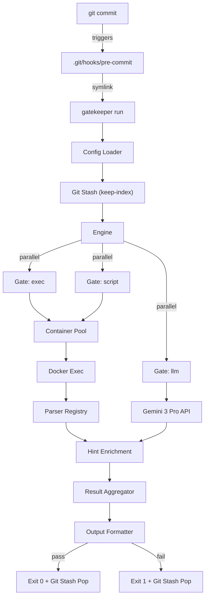

# Gatekeeper — Product Requirements Document

| Field | Value |
|---|---|
| **Author** | Ichsan |
| **Date** | 2026-02-15 |
| **Version** | 1.2 |
| **Status** | Draft |

---

## Executive Summary

Gatekeeper is an open-source, single-binary CLI tool that acts as a **git pre-commit hook gatekeeper**. It reads a declarative configuration file (`.gatekeeper/gates.yaml`), executes validation gates inside Docker containers in parallel, and blocks commits that fail any gate.

Gatekeeper is built for **AI-assisted development** — where code and commits are generated by AI agents almost all the time. Its structured, parseable output (JSON mode) gives agents precise file/line locations and fix hints, enabling fast automated remediation. For human developers, it provides rich CLI output with colors, hints, and clear failure context.

### What Makes This Special

1. **Container Isolation**: All validation runs in Docker — developers install zero linters on the host.
2. **LLM-Powered Gates**: Semantic code review via Gemini 3 Pro catches issues static tools miss.
3. **AI-Agent Output**: Structured JSON output designed for AI agent consumption — minimal context, maximum signal.
4. **Warm Containers**: Reuses Docker containers across commits for near-instant validation after cold start.
5. **Standardized Parsers**: SARIF-based parsing normalizes output from any linter into a unified error format with enriched hints.

---

## Product Scope

### MVP

| Component | Description |
|---|---|
| **CLI Binary** | Single Go binary with commands: `init`, `teardown`, `run`, `dry-run`, `cleanup`, `version` |
| **Configuration** | Two-layer: project `.gatekeeper/gates.yaml` + user `~/.config/gatekeeper/config.yaml` |
| **Gate Types** | `exec` (run command), `script` (run local script), `llm` (Gemini review) |
| **Execution Engine** | Parallel gate execution via goroutines with fan-out/aggregation |
| **Container Pool** | Docker warm containers, lazy cleanup on invocation, TTL-based expiration |
| **Parsers** | SARIF parser (universal), generic exit-code parser, `go-test-json` parser |
| **Output** | Rich CLI (colors, hints) + JSON (`--json` flag) |
| **Git Integration** | Pre-commit hook install/teardown, staged-files-only validation via `git stash` |
| **LLM Engine** | Gemini 3 Pro, diff mode only, per-file size limits |

### Post-MVP

| Feature | Description |
|---|---|
| **MCP Server** | Expose engine as MCP tools for edit-time validation by AI agents |
| **LLM Snapshot Mode** | Full-file review (not just diffs) for audits |
| **Blessed Images** | Pre-built `gatekeeper/go`, `gatekeeper/node`, `gatekeeper/python` images |
| **Shadow Mode** | Gates run and report but never block commits (team onboarding) |
| **LLM Cache** | Cache LLM results by diff hash to reduce API calls |
| **Multi-Provider LLM** | Support OpenAI, Anthropic, Ollama beyond Gemini |
| **`gatekeeper add`** | Interactive gate wizard / preset library |
| **Host Execution** | `--host-exec` fallback for environments without Docker |

### Vision

Become the standard **quality gatekeeper for AI-assisted development** — where AI agents write code and Gatekeeper ensures it meets human-defined quality standards before it enters the repository.

---

## Domain Context

Gatekeeper operates at the intersection of **Git internals**, **Docker orchestration**, and **LLM integration**.

| Domain | Complexity Source |
|---|---|
| **Git Hooks** | Staged-files-only validation, stash/restore lifecycle, hook installation |
| **Docker SDK** | Container pool management, warm runners, volume mounts, exec sessions |
| **Parser Engineering** | SARIF format parsing, tool-specific parsers, fail-closed error handling |
| **LLM Integration** | Prompt construction, structured output parsing, non-determinism, token limits |

---

## Success Criteria

| Criteria | Measurement |
|---|---|
| **Correctness** | Gates validate staged files only (not working directory) — verified by integration test |
| **Performance** | Warm execution completes all gates in < 3 seconds for a typical Go project |
| **Cold Start** | First run (image pull + container creation) completes in < 60 seconds |
| **Reliability** | System errors (tool crashes, Docker failures) are distinguished from validation failures |
| **DX** | `gatekeeper init` produces working config in < 5 seconds for Go/Node/Python projects |
| **AI-Agent UX** | JSON output is parseable, contains file/line/hint, and fits within typical agent context windows |

---

## Architecture Overview

### System Diagram



### Module Structure

```
gatekeeper/
├── cmd/
│   └── gatekeeper/       # CLI entry point (cobra)
├── pkg/
│   └── engine/           # Core engine (library, reusable by future MCP server)
│       ├── config/       # gates.yaml + global config parsing
│       ├── pool/         # Docker container pool (warm runners)
│       ├── executor/     # Docker exec abstraction
│       ├── gate/         # Gate interface + types (exec, script, llm)
│       ├── runner/       # Parallel execution engine
│       ├── parser/       # SARIF, go-test-json, generic parsers
│       ├── hints/        # Static hint database
│       ├── output/       # CLI + JSON formatters
│       ├── llm/          # Gemini client
│       └── git/          # Git stash, staged files, hook management
├── go.mod
└── go.sum
```

> [!IMPORTANT]
> The engine is designed as a **callable Go library** (`pkg/engine/`). The CLI is a thin wrapper. This enables a future MCP server entry point (`cmd/mcp/`) that reuses the same engine without duplication.

---

## Configuration

### Project Config: `.gatekeeper/gates.yaml`

```yaml
version: 1

defaults:
  container: golang:1.23       # default container image
  timeout: 30s                 # per-gate timeout
  blocking: true               # gates block commits by default
  on_error: block              # system errors block by default

gates:
  - name: unit_tests
    type: exec
    command: go test ./... -json
    container: golang:1.23
    parser: go-test-json
    timeout: 60s
    only: ["*.go"]

  - name: lint
    type: exec
    command: golangci-lint run --out-format sarif ./...
    container: golangci/golangci-lint:latest
    parser: sarif
    only: ["*.go"]

  - name: security
    type: exec
    command: gosec -fmt sarif ./...
    container: securego/gosec:latest
    parser: sarif
    only: ["*.go"]

  - name: format_check
    type: exec
    command: gofumpt -d .                # diff mode — read-only, AI-friendly output
    container: golang:1.23
    only: ["*.go"]

  - name: custom_check
    type: script
    path: ./scripts/validate-api.sh
    container: alpine:latest
    on_error: warn

  - name: secret_review
    type: llm
    provider: gemini-3-pro
    mode: diff
    prompt: "Check for hardcoded secrets, API keys, or credentials"
    max_file_size: 100KB
```

### User Config: `~/.config/gatekeeper/config.yaml`

```yaml
gemini_api_key: "AIza..."    # Gemini API key (secret, never committed)
container_ttl: 5m            # Warm container TTL (default 5 minutes)
output:
  color: true
  verbose: false
```

### Environment Variable Overrides

| Variable | Config Equivalent |
|---|---|
| `GATEKEEPER_GEMINI_KEY` | `gemini_api_key` |
| `GATEKEEPER_TTL` | `container_ttl` |
| `GATEKEEPER_NO_COLOR` | `output.color: false` |

---

## Functional Requirements

### Git Integration

| ID | Requirement |
|---|---|
| **FR1** | `gatekeeper init` detects the technology stack (Go, Node, Python) by scanning for `go.mod`, `package.json`, `requirements.txt` and generates a default `.gatekeeper/gates.yaml`. |
| **FR2** | `gatekeeper init` installs the pre-commit hook by creating a symlink at `.git/hooks/pre-commit` pointing to the gatekeeper binary. If a hook exists, prompt the user before overwriting. |
| **FR3** | `gatekeeper teardown` removes the git pre-commit hook symlink. The `.gatekeeper/` directory is preserved. |
| **FR4** | Before executing gates, the system stashes unstaged changes via `git stash push --keep-index --include-untracked` to ensure only staged files are validated. After execution (pass or fail), the stash is restored via `git stash pop`. **If any gate used `writable: true`**, run `git checkout -- .` and `git clean -fd` before stash pop to discard tool-written files and prevent merge conflicts. Edge cases: handle no-unstaged-changes (no stash created), crash recovery (defer pop), and **OS signal interruption** (trap `SIGINT`/`SIGTERM` via `os/signal.Notify` to guarantee stash pop before exit). |

### Configuration

| ID | Requirement |
|---|---|
| **FR5** | The system reads `.gatekeeper/gates.yaml` from the project root on every invocation. If the file is missing, exit with an error: `"No .gatekeeper/gates.yaml found. Run 'gatekeeper init' first."` |
| **FR6** | The system reads `~/.config/gatekeeper/config.yaml` for user-level settings. Missing file is acceptable (use defaults). Environment variables override file values. |
| **FR7** | Gate definitions support three types: `exec` (run command in container), `script` (run local script file in container), `llm` (send code to LLM for review). |
| **FR8** | Each gate supports optional fields: `container` (Docker image override), `parser` (output parser name), `timeout` (max duration), `blocking` (whether failure blocks commit), `on_error` (`block` or `warn` on system errors), `only`/`except` (file glob filters), `writable` (mount project read-write instead of read-only, default `false`). |

### Execution Engine

| ID | Requirement |
|---|---|
| **FR9** | All gates execute in parallel via goroutines. Results are aggregated before producing output. |
| **FR10** | If `defaults.fail_fast` is `true` or `--fail-fast` flag is passed, cancel remaining gates on first blocking failure. |
| **FR11** | For `exec` and `script` gates, commands are executed inside Docker containers via `docker exec`. Command strings are wrapped as `sh -c '<command>'` to ensure proper shell parsing of quoted arguments, pipes, and redirects. |
| **FR12** | The system maintains a warm container pool. On invocation: reuse existing containers matched by a **composite pool key** of `hash(image + absolute_project_path)` (prevents cross-project contamination), or create new ones (`sleep infinity` + label `gatekeeper.managed=true`, `gatekeeper.pool_key=<composite_key>`). Project root is bind-mounted **read-only** (`:ro`) by default. If a gate specifies `writable: true`, its container is created with read-write mount and `--user $(id -u):$(id -g)` to prevent root-owned files on the host. Tools requiring write access (caches, temp files) should use container-local `/tmp` (always writable). |
| **FR13** | On each invocation, the system performs lazy cleanup: stop and remove containers whose `gatekeeper.last_used` label exceeds the configured TTL. |
| **FR14** | `gatekeeper cleanup` stops and removes all containers with label `gatekeeper.managed=true`. |
| **FR15** | File filters (`only`/`except`) are evaluated against the list of staged files. If no staged files match a gate's filter, the gate is skipped. |

### Parsers & Output

| ID | Requirement |
|---|---|
| **FR16** | The system includes a **parser registry** supporting: `sarif` (universal SARIF format), `go-test-json` (Go test JSON output), and `generic` (fallback: exit code + raw stdout/stderr). If no parser is specified, `generic` is used. |
| **FR17** | Parsers produce a unified `StructuredError` object: `{file, line, column, severity, rule, message, hint, tool}`. The `hint` field is populated by the parser if the tool provides suggestions, or enriched from the static hint database for known rule IDs. |
| **FR18** | The system distinguishes **validation failures** (tool found issues) from **system errors** (tool crashed, timed out, produced malformed output). System errors respect the gate's `on_error` setting. Validation failures respect the gate's `blocking` setting. |

> [!IMPORTANT]
> **Fail-Closed Parsing (FR18)**: If a parser cannot parse tool output (malformed, truncated, unexpected format), this is a **system error**, not a pass. The gate is marked as failed-system-error. This prevents silent false-positive passes when tools break.

### LLM Gate

| ID | Requirement |
|---|---|
| **FR19** | LLM gates extract the `git diff --cached` for staged files and send it to Gemini 3 Pro with the user-defined prompt. The response is parsed as structured JSON matching the `StructuredError` schema. |
| **FR20** | Individual files exceeding `max_file_size` (default 100KB) are skipped with a warning in output. Remaining files are still reviewed. The gate does not fail due to skipped files alone. |
| **FR21** | LLM API calls include retry logic with exponential backoff (max 3 retries). Network failures are treated as system errors (respect `on_error`). |
| **FR22** | LLM gate requests **must** use Gemini's native Structured Output mode: set `response_mime_type="application/json"` and pass the `StructuredError` JSON Schema as `response_schema` in the API configuration. This enforces JSON output at the API infrastructure level. Temperature is set to 0. Do **not** rely on prompt-only instructions for JSON formatting. |

### CLI

| ID | Requirement |
|---|---|
| **FR23** | `gatekeeper run` exits 0 if all blocking gates pass, exits 1 if any blocking gate fails. Non-blocking gate failures are reported but do not affect exit code. |
| **FR24** | `gatekeeper dry-run` runs all gates identically to `run` but always exits 0 regardless of results. |
| **FR25** | `--json` flag outputs results as a single JSON object to stdout. Human-readable output goes to stderr when `--json` is used. |
| **FR26** | `--skip <name>` and `--skip-llm` flags allow skipping specific gates or all LLM gates respectively. |
| **FR27** | `--verbose` flag includes raw tool stdout/stderr in addition to parsed structured output. |
| **FR28** | CLI must display a **real-time progress indicator** (spinner + gate name) while gates are executing. For LLM gates, display elapsed time to reassure the user the process hasn't frozen. In `--json` mode, progress is suppressed. |

---

## Non-Functional Requirements

### Performance

| ID | Requirement |
|---|---|
| **NFR1** | Warm gate execution (container exists, image pulled) must complete within the gate's configured timeout (default 30s). |
| **NFR2** | Container pool supports per-image warm runners. Multiple images run concurrently (e.g., `golang:1.23` + `node:20` for polyglot projects). |
| **NFR3** | Warm container TTL defaults to 5 minutes, configurable via user config or environment variable. |
| **NFR4** | The gatekeeper binary itself should add < 100ms overhead beyond gate execution time. |

### Security

| ID | Requirement |
|---|---|
| **NFR5** | The Gemini API key is stored in user config (`~/.config/gatekeeper/config.yaml`) or environment variable. It must never be written to `.gatekeeper/gates.yaml` or any project-level file. |
| **NFR6** | Docker containers are ephemeral (warm but replaceable). No persistent state is stored in containers. |

### Reliability

| ID | Requirement |
|---|---|
| **NFR7** | Git stash operations use `defer` **and** OS signal trapping (`os/signal.Notify` for `SIGINT`, `SIGTERM`) to guarantee stash restoration on panic, unexpected exit, **and** user interrupt (`Ctrl+C`). The signal handler must: (1) cancel the execution context, (2) wait for running gates to stop, (3) run `git stash pop`, (4) then `os.Exit(1)`. |
| **NFR8** | Container labels (`gatekeeper.managed=true`, `gatekeeper.last_used`) are the source of truth for pool state. The binary is stateless between invocations. |
| **NFR9** | If Docker daemon is unavailable, exit with a clear, context-specific error message: `"permission denied"` → `"Add your user to the docker group: sudo usermod -aG docker $USER"`, `"connection refused"` → `"Docker is not running. Start it with: sudo systemctl start docker"`, other → `"Docker is required. Install it from https://docker.com"`. Do not leave git in a stashed state. |

### Testability

| ID | Requirement |
|---|---|
| **NFR10** | The engine accepts a `ContainerRuntime` interface, allowing mock Docker implementations in tests. |
| **NFR11** | Parsers are tested with fixtures: valid output, malformed output, empty output, and truncated output. All malformed/empty/truncated inputs must trigger system error (fail-closed). |
| **NFR12** | Git operations are abstracted behind an interface for unit testing without a real repository. |
| **NFR13** | Docker exec output streams must be demultiplexed using `stdcopy.StdCopy` (from `github.com/docker/docker/pkg/stdcopy`) when `Tty=false`, to correctly separate stdout and stderr. Failure to demux causes corrupted parser input. |

---

## User Experience

### CLI Output Design

**During execution (real-time progress):**
```
🔒 Gatekeeper — running 4 gates...

  ⏳ unit_tests      running...
  ⏳ lint             running...
  ✅ security         0.5s
  ⏳ secret_review    running... (2.1s elapsed)
```

**On success:**
```
🔒 Gatekeeper — 4 gates passed (2.1s)

  ✅ unit_tests      1.2s
  ✅ lint             0.8s
  ✅ security         0.5s
  ✅ secret_review    2.1s
```

**On failure:**
```
🔒 Gatekeeper — 1 failed, 3 passed (2.3s)

  ✅ unit_tests      1.2s
  ✅ lint             0.8s
  ❌ security         0.5s
  ✅ secret_review    2.1s

──────────────────────────────────────

❌ security (gosec)

  auth/handler.go:45:12  error  G101
  Potential hardcoded credentials
  💡 Use environment variables or a secret manager

  api/db.go:23:5  warning  G201
  SQL string formatting
  💡 Use parameterized queries ($1, $2)

──────────────────────────────────────

❌ Commit blocked — 1 gate failed
```

**On system error:**
```
💥 SYSTEM ERROR — gate: lint

  Container failed to start: image "golangci/golangci-lint:fakever" not found
  Gate config: on_error=block → commit blocked

  💡 Fix the container image in .gatekeeper/gates.yaml
```

### JSON Output (`--json`)

```json
{
  "passed": false,
  "duration_ms": 2300,
  "gates": [
    {
      "name": "security",
      "type": "exec",
      "passed": false,
      "blocking": true,
      "duration_ms": 500,
      "errors": [
        {
          "file": "auth/handler.go",
          "line": 45,
          "column": 12,
          "severity": "error",
          "rule": "gosec:G101",
          "message": "Potential hardcoded credentials",
          "hint": "Use environment variables or a secret manager",
          "tool": "gosec"
        }
      ]
    }
  ]
}
```

---

## Verification Plan

### Automated Tests

| Test | Description |
|---|---|
| Unit: Config parser | Parse valid, invalid, and partial `gates.yaml` files |
| Unit: SARIF parser | Parse SARIF output from golangci-lint, gosec, ruff |
| Unit: go-test-json parser | Parse `go test -json` output |
| Unit: Generic parser | Verify exit code detection + raw output capture |
| Unit: Hint enrichment | Known rule IDs produce hints; unknown rules produce empty hints |
| Unit: Fail-closed | Malformed, empty, truncated parser inputs trigger system error |
| Unit: Pool key isolation | Verify two projects with same image get different containers |
| Integration: Container pool | Create, reuse, and cleanup containers via Docker SDK |
| Integration: Read-only mount | Verify container cannot write to `/workspace` |
| Integration: Full pipeline | `gates.yaml` → parallel execution → aggregated output |
| Integration: Git stash | Verify staged-only validation with unstaged changes present |
| Integration: SIGINT stash safety | Send `SIGINT` during gate execution, verify stash is restored |
| Integration: LLM gate | Mock Gemini API with `response_schema`, verify structured output parsing |
| Integration: Stream demux | Verify stdout/stderr are correctly separated via `stdcopy.StdCopy` |

### Manual Verification

| Test | Description |
|---|---|
| `gatekeeper init` | Run in Go, Node, and Python projects — verify correct stack detection and config generation |
| End-to-end commit | Make a commit with a known security issue, verify Gatekeeper blocks it |
| `Ctrl+C` during commit | Press `Ctrl+C` while LLM gate is running, verify working directory is intact |
| Cross-project isolation | Open two projects with same stack, verify containers are isolated per project |
| `gatekeeper dry-run` | Verify failures are reported but commit is not blocked |
| Writable gate | Configure a gate with `writable: true`, verify UID mapping and git checkout cleanup |
| `--json` output | Pipe to `jq`, verify parseable and complete |
| Cold start | Time from zero to first gate completion (target: < 60s) |
| Warm start | Time for subsequent commits (target: < 3s) |
